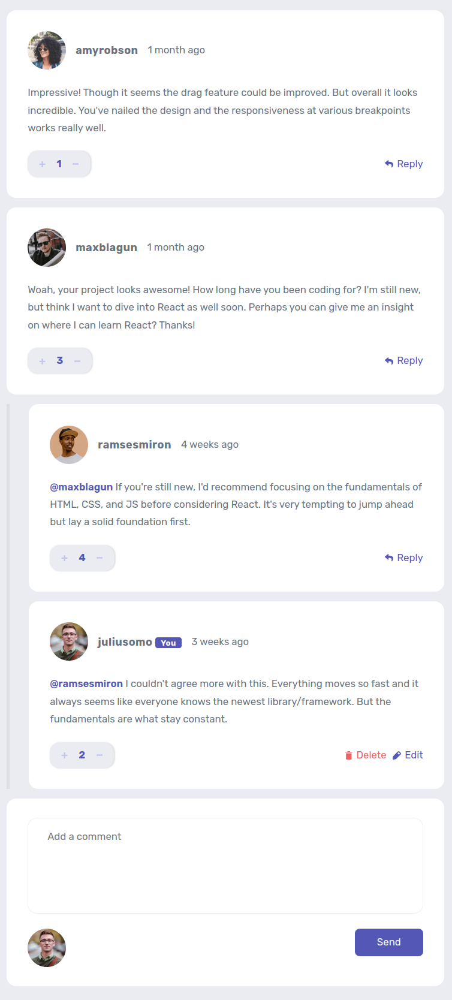

# Frontend Mentor - Interactive comments section solution

This is a solution to the [Interactive comments section challenge on Frontend Mentor](https://www.frontendmentor.io/challenges/interactive-comments-section-iG1RugEG9).

## Table of contents

- [Overview](#overview)
  - [The challenge](#the-challenge)
  - [Screenshot](#screenshot)
  - [Links](#links)
- [My process](#my-process)
  - [Built with](#built-with)
  - [Useful resources](#useful-resources)
- [Author](#author)

## Overview

### The challenge

Users should be able to:

- View the optimal layout for the app depending on their device's screen size
- See hover states for all interactive elements on the page
- Create, Read, Update, and Delete comments and replies
- Upvote and downvote comments
- when the user click on name on a sub comment the screen will scroll smoothly and take him to the replied comment
- **Bonus**: I use `localStorage` to save the current state in the browser that persists when the browser is refreshed.
- **Bonus**: Instead of using the `createdAt` strings from the `data.json` file, i use timestamps and dynamically track the time since the comment or reply was posted.

#### Expected behaviour

- First-level comments should be ordered by their score, whereas nested replies are ordered by time added.
- Replying to a comment adds the new reply to the bottom of the nested replies within that comment.
- A confirmation modal should pop up before a comment or reply is deleted.
- Adding a new comment or reply uses the `currentUser` object from within the `data.json` file.
- You can only edit or delete your own comments and replies.

### Screenshot

#### Desktop

#### Mobile

### Links

- Solution URL: [Github](https://github.com/belhocineAbdelkader/interactive-comments-section)
- **Live Site URL:** [interactive-comments-section](https://interactive-comments-section-kappa-six.vercel.app/)

## My process

### Built with

- Semantic HTML5 markup
- Flexbox
- CSS Grid
- Typescript
- Javascript
- Sass

### Useful resources

- [**OKLCH Color Picker & Converter**](https://oklch.com/#84.86,0.083,15.65,100) - Color picker and converter for OKLCH and LCH color space.

- [**Clamped font sizes**](https://utopia.fyi/) - This is an amazing site which helped me to make responsive font size depending on the screen size.

- [**Variable fonts guide MDN**](https://developer.mozilla.org/en-US/docs/Web/CSS/CSS_Fonts/Variable_Fonts_Guide) - Variable fonts are an evolution of the OpenType font specification that enables many different variations of a typeface to be incorporated into a single file.

- [**Font Converter**](https://cloudconvert.com/ttf-to-woff2) - convert fonts.

- [`article` **element MDN**](https://developer.mozilla.org/en-US/docs/Web/HTML/Element/article#usage_notes) - Read This amazing article about `article` element.

- [`time` **element MDN**](https://developer.mozilla.org/en-US/docs/Web/HTML/Element/time#datetime) - Read This amazing article about `time` element.

- [`dialog` **element**](https://developer.mozilla.org/en-US/docs/Web/HTML/Element/dialog?retiredLocale=ar) - Read This amazing article about `dialog` element from **MDN**.

- [**can i use `dialog` element**](https://caniuse.com/dialog)

- [**`dialog` element**](https://html.spec.whatwg.org/multipage/interactive-elements.html#the-dialog-element) - Read This amazing article about `dialog` element.

- **Optimize long tasks** - this is a great articles about how make make user experience more good.
  - [Article from **MDN**](https://developer.mozilla.org/en-US/docs/Web/API/Scheduler/postTask)
  - [Article from **web.dev**](https://web.dev/articles/optimize-long-tasks?utm_source=devtools)

- [`scheduler` **polyfill**](https://github.com/GoogleChromeLabs/scheduler-polyfill) - This is a polyfill for the Prioritized Task Scheduling API.

## Author

- Website - [Belhocine Abdelkader](https://github.com/belhocineAbdelkader)
- Frontend Mentor - [@belhocineAbdelkader](https://www.frontendmentor.io/profile/belhocineAbdelkader)
- Twitter - [@BelhocineAek](https://twitter.com/BelhocineAek)
- linkedin - [@belhocine-abdelkader](https://www.linkedin.com/in/belhocine-abdelkader-238653263/)
- Facebook - [@belhocine-abdelkader](https://www.linkedin.com/in/belhocine-abdelkader-238653263/)
